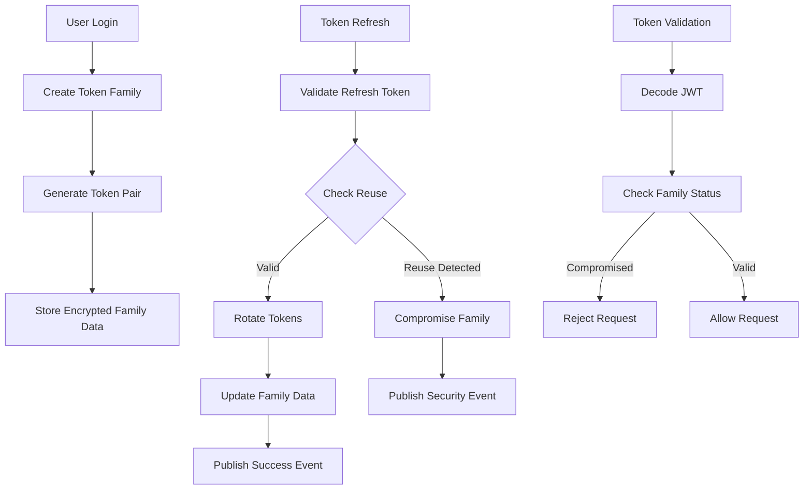

# Unified Authentication Architecture

## Overview

This document describes the unified authentication architecture that implements domain-driven design (DDD) principles with advanced token family security patterns. The architecture eliminates Redis dependencies in favor of a database-only approach with field-level encryption and comprehensive security monitoring.

## Architecture Principles

### Domain-Driven Design (DDD)
- **Ubiquitous Language**: All components use business-centric naming
- **Bounded Context**: Clear separation of authentication domain concerns
- **Domain Services**: Business logic encapsulated in domain services
- **Repository Pattern**: Clean abstraction for data persistence
- **Dependency Inversion**: Domain depends on abstractions, not concretions

### Clean Architecture
- **Layer Separation**: Clear boundaries between domain, infrastructure, and application layers
- **Interface Segregation**: Focused, client-specific interfaces
- **Single Responsibility**: Each component has one clear purpose
- **Open/Closed Principle**: Architecture is open for extension, closed for modification

## Architecture Comparison

### Before: Dual Storage Architecture
```
┌─────────────────┐    ┌─────────────────┐
│    Redis        │    │   PostgreSQL    │
│ (Token Cache)   │    │ (Session Data)  │
├─────────────────┤    ├─────────────────┤
│ • Token storage │    │ • User data     │
│ • Fast access   │    │ • Session state │
│ • Blacklists    │    │ • Audit logs    │
└─────────────────┘    └─────────────────┘
```

**Problems with Dual Storage:**
- Consistency issues between Redis and PostgreSQL
- Complex synchronization logic
- Race conditions during concurrent operations
- Operational complexity with multiple storage systems
- No unified encryption strategy

### After: Unified Database Architecture
```
┌───────────────────────────────────────┐
│            PostgreSQL                 │
│        (Unified Storage)              │
├───────────────────────────────────────┤
│ • Encrypted token families            │
│ • User authentication data            │
│ • Security audit trails               │
│ • Threat detection metadata           │
│ • Performance metrics                 │
└───────────────────────────────────────┘
```

**Benefits of Unified Storage:**
- ACID transactions for all operations
- Field-level encryption for sensitive data
- Simplified deployment and operations
- Consistent security policies
- Enhanced audit capabilities

## Domain Model

### Core Entities

#### TokenFamily Entity
```typescript
// Domain representation
class TokenFamily {
  family_id: string          // Unique identifier
  user_id: number            // User association
  status: TokenFamilyStatus  // Active, compromised, revoked, expired
  created_at: datetime       // Creation timestamp
  last_used_at: datetime     // Activity tracking
  expires_at: datetime       // Expiration time
  
  // Encrypted fields (automatically handled by repository)
  active_tokens: TokenId[]            // Currently valid tokens
  revoked_tokens: TokenId[]           // Revoked tokens for reuse detection
  usage_history: TokenUsageRecord[]   // Security analysis data
  
  // Security metadata
  compromise_reason?: string          // If compromised, the reason
  security_score: number             // Risk assessment score
  
  // Business methods
  add_token(token_id: TokenId): void
  revoke_token(token_id: TokenId, reason: string): void
  is_compromised(): boolean
  calculate_security_score(): number
}
```

#### SecurityContext Value Object
```typescript
class SecurityContext {
  client_ip: string          // Client IP address
  user_agent: string         // Browser/client information
  request_timestamp: datetime // When request was made
  correlation_id?: string    // Request tracking ID
  
  // Validation methods
  is_valid(): boolean
  get_risk_indicators(): string[]
  matches_previous_context(other: SecurityContext): boolean
}
```

### Value Objects

#### TokenPair
```typescript
class TokenPair {
  access_token: string       // JWT access token
  refresh_token: string      // JWT refresh token
  family_id: string         // Token family association
  token_type: string        // "bearer"
  expires_in: number        // Access token TTL in seconds
  
  // Security metadata
  security_context: SecurityContext
  created_at: datetime
}
```

#### Request Objects
```typescript
class TokenCreationRequest {
  user: User
  security_context: SecurityContext
  correlation_id?: string
}

class TokenRefreshRequest {
  refresh_token: string
  security_context: SecurityContext
  correlation_id?: string
  language: string = "en"
}
```

## Service Architecture

### Domain Layer Services

#### TokenLifecycleManagementService
**Purpose**: Core business logic for token lifecycle management
**Responsibilities**:
- Token pair creation with family security
- Secure token refresh with reuse detection
- Token validation with comprehensive security checks
- Security incident detection and response
- Audit trail generation

```typescript
interface ITokenLifecycleManagementService {
  create_token_pair_with_family_security(request: TokenCreationRequest): Promise<TokenPair>
  refresh_tokens_with_family_security(request: TokenRefreshRequest): Promise<TokenPair>
  validate_token_with_family_security(
    access_token: string, 
    security_context: SecurityContext
  ): Promise<Dict<string, any>>
}
```

### Infrastructure Layer Services

#### DomainTokenService
**Purpose**: Infrastructure bridge for domain token service
**Responsibilities**:
- Database transaction management
- JWT encoding/decoding with infrastructure settings
- Event publishing to infrastructure systems
- Error handling and HTTP response mapping
- Legacy compatibility methods

```typescript
class DomainTokenService implements ITokenService, ITokenLifecycleManagementService {
  // New domain methods
  create_token_pair_with_family_security(request: TokenCreationRequest): Promise<TokenPair>
  refresh_tokens_with_family_security(request: TokenRefreshRequest): Promise<TokenPair>
  validate_token_with_family_security(access_token: string, context: SecurityContext): Promise<Dict>
  
  // Legacy compatibility methods (deprecated)
  create_access_token(user: User, jti?: string): Promise<string>
  create_refresh_token(user: User, jti?: string): Promise<string>
  refresh_tokens(refresh_token: string): Promise<Mapping<string, string>>
  validate_token(token: string): Promise<Mapping<string, any>>
  
  // Administrative methods
  revoke_token_family(family_id: string, reason: string): Promise<boolean>
  get_user_active_families(user_id: number): Promise<TokenFamily[]>
}
```

### Repository Layer

#### TokenFamilyRepository
**Purpose**: Persistence abstraction with encryption
**Responsibilities**:
- CRUD operations for token families
- Automatic encryption/decryption of sensitive data
- Security metrics collection
- Performance optimization
- Transaction management

```typescript
interface ITokenFamilyRepository {
  create_family(user_id: number, options?: CreateOptions): Promise<TokenFamily>
  get_family_by_id(family_id: string): Promise<TokenFamily?>
  update_family(family: TokenFamily): Promise<TokenFamily>
  rotate_tokens(family_id: string, old_jti: string, new_tokens: TokenPair): Promise<void>
  compromise_family(family_id: string, reason: string): Promise<void>
  is_token_revoked(family_id: string, jti: string): Promise<boolean>
  get_security_metrics(user_id?: number): Promise<Dict<string, any>>
}
```

## Security Features

### Token Family Security Pattern

#### Family-based Token Management
- **Token Families**: Group related tokens sharing security properties
- **Family-wide Revocation**: Immediate containment when security violations detected
- **Reuse Detection**: Real-time detection of previously revoked token usage
- **Security Correlation**: Track patterns across related authentication events

#### Security Flow Diagram


### Field-Level Encryption

#### Encryption Service
```typescript
class FieldEncryptionService {
  encrypt_token_list(tokens: TokenId[]): string
  decrypt_token_list(encrypted_data: string): TokenId[]
  encrypt_usage_history(history: TokenUsageRecord[]): string
  decrypt_usage_history(encrypted_data: string): TokenUsageRecord[]
}
```

#### Encryption Features
- **Fernet Encryption**: AES-128-CBC + HMAC-SHA256 for authenticated encryption
- **Key Management**: Integration with existing PGCRYPTO_KEY infrastructure
- **Version Support**: Future algorithm upgrades without data migration
- **Performance**: Sub-millisecond encryption/decryption operations

### Threat Detection and Response

#### Real-time Threat Analysis
- **Token Reuse Detection**: Immediate detection of replay attacks
- **Pattern Analysis**: Behavioral analysis with risk scoring
- **Geographic Validation**: Location-based security checks
- **Device Fingerprinting**: Client identification and validation

#### Security Incident Response
```typescript
enum SecurityThreatLevel {
  LOW = "low",
  MEDIUM = "medium", 
  HIGH = "high",
  CRITICAL = "critical"
}

class SecurityAssessment {
  threat_level: SecurityThreatLevel
  confidence_score: number  // 0.0 to 1.0
  indicators: string[]      // Specific threat indicators
  recommended_action: string // "allow", "warn", "block"
}
```

## Database Schema

### Token Families Table
```sql
CREATE TYPE token_family_status AS ENUM ('active', 'compromised', 'revoked', 'expired');

CREATE TABLE token_families (
    -- Core identifiers
    family_id VARCHAR(64) PRIMARY KEY,
    user_id INTEGER NOT NULL REFERENCES users(id),
    
    -- Lifecycle tracking
    status token_family_status NOT NULL DEFAULT 'active',
    created_at TIMESTAMP WITH TIME ZONE NOT NULL DEFAULT CURRENT_TIMESTAMP,
    last_used_at TIMESTAMP WITH TIME ZONE NOT NULL DEFAULT CURRENT_TIMESTAMP,
    expires_at TIMESTAMP WITH TIME ZONE NOT NULL,
    compromised_at TIMESTAMP WITH TIME ZONE,
    
    -- Encrypted sensitive data
    active_tokens_encrypted TEXT NOT NULL DEFAULT '[]',
    revoked_tokens_encrypted TEXT NOT NULL DEFAULT '[]',
    usage_history_encrypted TEXT NOT NULL DEFAULT '[]',
    
    -- Security metadata
    compromise_reason TEXT,
    security_score DECIMAL(3,2) NOT NULL DEFAULT 1.00,
    
    -- Performance indexes
    INDEX idx_token_families_user_status (user_id, status),
    INDEX idx_token_families_expires_at (expires_at),
    INDEX idx_token_families_last_used (last_used_at),
    INDEX idx_token_families_security_score (security_score)
);
```

### Performance Characteristics
- **Sub-millisecond Operations**: Optimized for high-throughput applications
- **Strategic Indexing**: Fast queries with minimal overhead
- **Partitioning Ready**: Supports horizontal scaling
- **Concurrent Safety**: Race condition protection with proper locking

## Migration Strategy

### Phase 1: Parallel Operation (Week 1-2)
- Deploy new architecture alongside existing Redis system
- Feature flag controls which system handles new tokens
- Comprehensive monitoring and comparison testing
- Performance validation under production load

### Phase 2: Feature Flag Toggle (Week 3-4)
- Gradual migration of traffic to new system
- A/B testing with real production traffic
- Monitor security metrics and performance
- Rollback capability maintained

### Phase 3: Full Migration (Week 5-6)
- Complete migration to unified architecture
- Remove Redis dependencies from token operations
- Maintain legacy support for existing tokens
- Update all authentication endpoints

### Phase 4: Cleanup and Optimization (Week 7-8)
- Remove legacy code and Redis infrastructure
- Optimize database performance
- Finalize documentation and training
- Performance tuning and monitoring setup

## Performance Metrics

### Latency Requirements
- **Token Creation**: < 10ms (95th percentile)
- **Token Validation**: < 1ms (95th percentile)
- **Token Refresh**: < 5ms (95th percentile)
- **Security Analysis**: < 2ms (95th percentile)

### Throughput Targets
- **Token Operations**: 10,000+ operations/second
- **Concurrent Users**: 100,000+ active sessions
- **Database Connections**: Efficient connection pooling
- **Memory Usage**: Optimized for container environments

## Monitoring and Observability

### Security Metrics
```typescript
interface SecurityMetrics {
  token_reuse_attempts: number
  compromised_families: number
  failed_validations: number
  threat_level_distribution: Dict<SecurityThreatLevel, number>
  geographic_anomalies: number
  device_fingerprint_mismatches: number
}
```

### Performance Metrics
```typescript
interface PerformanceMetrics {
  operation_latencies: Dict<string, LatencyStats>
  throughput_rates: Dict<string, number>
  error_rates: Dict<string, number>
  database_performance: DatabaseMetrics
  encryption_overhead: EncryptionMetrics
}
```

### Monitoring Integration
- **Structured Logging**: JSON-formatted logs with correlation IDs
- **Metrics Collection**: Prometheus-compatible metrics
- **Alerting**: Critical security events trigger immediate alerts
- **Dashboards**: Real-time security and performance dashboards

## Testing Strategy

### Unit Testing
- **Domain Logic**: Comprehensive coverage of business rules
- **Security Patterns**: Token family security validation
- **Edge Cases**: Error handling and boundary conditions
- **Performance**: Sub-millisecond operation validation

### Integration Testing
- **Database Operations**: Transaction integrity and encryption
- **Token Lifecycle**: End-to-end authentication flows
- **Security Scenarios**: Attack simulation and response
- **Migration Compatibility**: Legacy token support validation

### Security Testing
- **Penetration Testing**: Attack simulation and response validation
- **Token Reuse Attacks**: Replay attack detection and mitigation
- **Family Compromise**: Family-wide revocation testing
- **Performance Under Attack**: System behavior during security incidents

## Deployment Considerations

### Infrastructure Requirements
- **Database**: PostgreSQL 13+ with encryption support
- **Compute**: CPU optimized for encryption operations
- **Memory**: Adequate for connection pooling and caching
- **Network**: Low latency for real-time security analysis

### Security Configuration
- **Encryption Keys**: Secure key management and rotation
- **Database Security**: Connection encryption and access controls
- **Monitoring**: Security event alerting and response
- **Backup**: Encrypted backup and recovery procedures

### Operational Procedures
- **Deployment**: Blue-green deployment with rollback capability
- **Monitoring**: Real-time security and performance monitoring
- **Incident Response**: Security incident escalation procedures
- **Maintenance**: Database maintenance and optimization

## Future Enhancements

### Advanced Security Features
- **Machine Learning**: AI-powered threat detection
- **Biometric Integration**: Device and behavioral biometrics
- **Zero Trust**: Enhanced verification requirements
- **Quantum Resistance**: Post-quantum cryptography preparation

### Performance Optimizations
- **Caching Layer**: Redis for non-sensitive performance data
- **Database Sharding**: Horizontal scaling for large deployments
- **CDN Integration**: Global token validation endpoints
- **Edge Computing**: Distributed security analysis

### Compliance and Governance
- **Audit Trails**: Enhanced forensic analysis capabilities
- **Compliance Reporting**: Automated compliance validation
- **Data Residency**: Geographic data storage requirements
- **Privacy Controls**: Enhanced user privacy protections

## Conclusion

The unified authentication architecture provides enterprise-grade security with comprehensive token family management, field-level encryption, and advanced threat detection. The database-only approach simplifies operations while enhancing security and consistency.

The architecture follows domain-driven design principles with clean separation of concerns, making it maintainable, testable, and extensible for future requirements. 