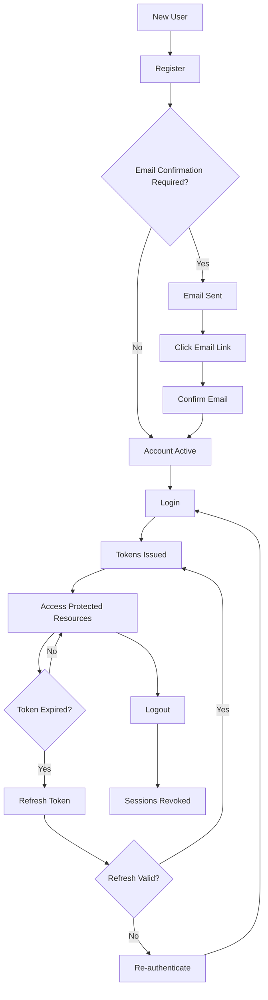

# Authentication System

Cedrina implements a comprehensive, production-grade authentication system built on **Domain-Driven Design (DDD)** principles with **Clean Architecture**, providing enterprise-level security features including JWT tokens, OAuth integration, email confirmation, password management, and advanced security patterns.

## 📋 Overview

The authentication system provides secure user registration, login, token management, and account security features with the following key capabilities:

- **Multi-Channel Authentication**: Username/password, OAuth (Google, Microsoft, Facebook)
- **Advanced Token Security**: JWT with RS256 signing, token family security, session management
- **Email Verification**: Configurable email confirmation with resend functionality
- **Password Management**: Secure password policies, change, reset, and forgot password flows
- **Security Features**: Rate limiting, brute force protection, session revocation, audit logging
- **Internationalization**: Multi-language support (English, Spanish, Arabic, Farsi)
- **Database-Only Storage**: No Redis dependency, complete PostgreSQL-based session management

## 🚀 Quick Start

### Basic Authentication Flow

```bash
# 1. Register a new user
curl -X POST "http://localhost:8000/api/v1/auth/register" \
  -H "Content-Type: application/json" \
  -d '{
    "username": "john_doe",
    "email": "john@example.com", 
    "password": "SecurePass123!"
  }'

# 2. Login (after email confirmation if required)
curl -X POST "http://localhost:8000/api/v1/auth/login" \
  -H "Content-Type: application/json" \
  -d '{
    "username": "john_doe",
    "password": "SecurePass123!"
  }'

# 3. Use access token for protected endpoints
curl -X GET "http://localhost:8000/api/v1/protected-endpoint" \
  -H "Authorization: Bearer <access_token>"

# 4. Refresh tokens when needed
curl -X POST "http://localhost:8000/api/v1/auth/refresh" \
  -H "Authorization: Bearer <access_token>" \
  -H "X-Refresh-Token: <refresh_token>" \
  -H "Content-Type: application/json" \
  -d '{}'

# 5. Logout (revokes all tokens)
curl -X POST "http://localhost:8000/api/v1/auth/logout" \
  -H "Authorization: Bearer <access_token>"
```

## 📚 Endpoints Documentation

### 🔐 Core Authentication
- **[User Registration](registration.md)** - `POST /api/v1/auth/register`
- **[User Login](login.md)** - `POST /api/v1/auth/login`
- **[User Logout](logout.md)** - `POST /api/v1/auth/logout`
- **[Token Refresh](refresh-token.md)** - `POST /api/v1/auth/refresh`

### 🔑 Password Management
- **[Change Password](change-password.md)** - `PUT /api/v1/auth/change-password`
- **[Forgot Password](forgot-password.md)** - `POST /api/v1/auth/forgot-password`
- **[Reset Password](reset-password.md)** - `POST /api/v1/auth/reset-password`

### ✉️ Email Verification
- **[Confirm Email](confirm-email.md)** - `GET /api/v1/auth/confirm-email`
- **[Resend Confirmation](resend-confirmation.md)** - `POST /api/v1/auth/resend-confirmation`

### 🌐 OAuth Integration
- **[OAuth Authentication](oauth.md)** - `POST /api/v1/auth/oauth`

## 🛡️ Security Features

### Token Security
- **JWT with RS256**: Asymmetric signing for enhanced security
- **Token Family Security**: JTI matching between access and refresh tokens
- **Token Rotation**: New tokens issued on refresh for security
- **Session Revocation**: Immediate session invalidation on logout
- **Database-Only Storage**: No Redis dependency, PostgreSQL-based sessions

### Protection Mechanisms
- **Rate Limiting**: Configurable limits per endpoint and user/IP
- **Brute Force Protection**: Login attempt limiting with exponential backoff
- **Input Validation**: Comprehensive validation against injection attacks
- **Timing Attack Prevention**: Constant-time comparisons using `hmac.compare_digest`
- **Audit Logging**: Comprehensive security event logging

### Password Security
- **Strong Password Policy**: Minimum 8 characters, mixed case, numbers, special characters
- **Password Reuse Prevention**: Prevents using the same password
- **Secure Hashing**: bcrypt with configurable rounds
- **Password Reset Security**: Secure token-based reset flow

## 🌍 Internationalization

All endpoints support multiple languages via the `Accept-Language` header:

- **English** (`en`) - Default
- **Spanish** (`es`)
- **Arabic** (`ar`) 
- **Farsi** (`fa`)

Example:
```bash
curl -X POST "http://localhost:8000/api/v1/auth/login" \
  -H "Accept-Language: es" \
  -H "Content-Type: application/json" \
  -d '{"username": "juan", "password": "MiPassword123!"}'
```

Response:
```json
{
  "detail": "Nombre de usuario o contraseña inválidos"
}
```

## 📊 Rate Limiting

The authentication system implements sophisticated rate limiting to prevent abuse:

| Endpoint | Rate Limit | Window |
|----------|------------|---------|
| Login | 5 attempts | 1 minute |
| Register | 3 attempts | 1 minute |
| Refresh Token | 10 attempts | 1 minute |
| Forgot Password | 3 attempts | 1 hour |
| Reset Password | 5 attempts | 1 hour |
| OAuth | 10 attempts | 1 minute |

### Rate Limit Headers
```http
X-RateLimit-Limit: 5
X-RateLimit-Remaining: 2
X-RateLimit-Reset: 1642234567
```

### Rate Limit Exceeded Response
```json
{
  "detail": "Rate limit exceeded. Try again in 45 seconds."
}
```

## 🔄 Authentication Flow States



## 📈 Security Monitoring

### Audit Events
The system logs comprehensive security events:

- **Authentication Events**: Login, logout, failed attempts
- **Token Events**: Token issuance, refresh, revocation
- **Security Violations**: Invalid token usage, suspicious activity
- **Account Events**: Registration, email confirmation, password changes

### Log Format
```json
{
  "timestamp": "2025-01-15T10:30:00Z",
  "level": "INFO",
  "event": "user_login_success",
  "user_id": 123,
  "ip_address": "192.168.1.100",
  "user_agent": "Mozilla/5.0...",
  "correlation_id": "req_abc123"
}
```

## 🚨 Error Handling

### Standard Error Response
```json
{
  "detail": "Human-readable error message in user's language"
}
```

### Common Status Codes
- **200 OK**: Successful operation
- **201 Created**: User registration success
- **400 Bad Request**: Business logic errors (wrong password, etc.)
- **401 Unauthorized**: Authentication failures, invalid tokens
- **403 Forbidden**: Insufficient permissions
- **404 Not Found**: Resource not found
- **409 Conflict**: Duplicate resources (username, email)
- **422 Unprocessable Entity**: Validation errors
- **429 Too Many Requests**: Rate limit exceeded

## 🔧 Configuration

### Environment Variables
```bash
# JWT Configuration
JWT_ISSUER="https://api.cedrina.com"
JWT_AUDIENCE="cedrina:api:v1"
ACCESS_TOKEN_EXPIRE_MINUTES=15
REFRESH_TOKEN_EXPIRE_DAYS=7

# Email Confirmation
EMAIL_CONFIRMATION_REQUIRED=true
EMAIL_CONFIRMATION_TOKEN_EXPIRE_HOURS=24

# Password Policy
PASSWORD_MIN_LENGTH=8
PASSWORD_REQUIRE_UPPERCASE=true
PASSWORD_REQUIRE_LOWERCASE=true
PASSWORD_REQUIRE_DIGIT=true
PASSWORD_REQUIRE_SPECIAL=true

# Rate Limiting
RATE_LIMIT_STORAGE="memory://"  # or "redis://localhost:6379"
```

## 🔍 Troubleshooting

### Common Issues

**401 Unauthorized on Token Refresh**
- Verify both access and refresh tokens are provided in headers
- Check that tokens belong to the same session (matching JTI)
- Ensure tokens haven't been revoked via logout

**422 Validation Error on Registration**
- Verify password meets policy requirements
- Check username doesn't contain spaces or special characters
- Ensure email format is valid

**429 Rate Limit Exceeded**
- Wait for the rate limit window to reset
- Implement exponential backoff in client applications
- Check rate limit headers for reset time

**Session Revoked Error**
- User has logged out - tokens are permanently invalidated
- Re-authenticate to get new tokens
- Check audit logs for logout events

### Debug Mode
Enable debug logging to troubleshoot authentication issues:

```bash
export LOG_LEVEL=DEBUG
export SECURITY_DEBUG=true
```

## 📖 Related Documentation

- **[API Reference](../../reference/api-reference.md)** - Complete API documentation
- **[Security Architecture](../../architecture/security-architecture.md)** - Security design and threat model
- **[Database Schema](../../reference/database-schema.md)** - Authentication-related tables
- **[Error Codes](../../reference/error-codes.md)** - Complete error code reference
- **[Token Management](../token-management/)** - Advanced token features
- **[Rate Limiting](../rate-limiting/)** - Rate limiting configuration